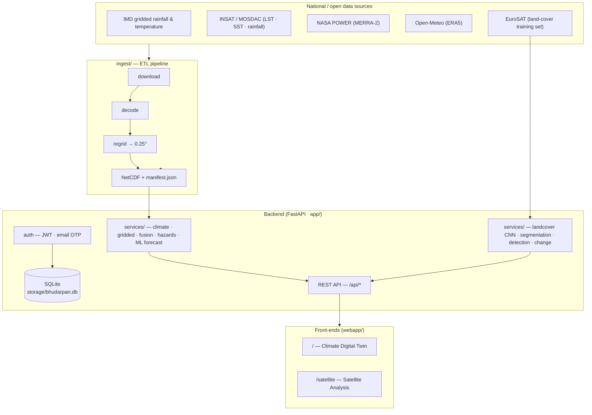

# Bhū-Darpan — System Architecture

An AI-powered **Digital Twin of India's Climate** (Jammu & Kashmir pilot) plus a
satellite image-analysis module, served by a single FastAPI backend with two
zero-build single-page front-ends.

---

## 1. High-level architecture

---

## 2. Proof-of-Concept workflow (PS "Figure 1")

```mermaid
flowchart LR
    A["Define problem\n& pilot region (J&K)"] --> B["Collect national datasets\n(IMD · ISRO · reanalysis)"]
    B --> C["Pre-process & integrate\n(regrid to common 0.25° grid)"]
    C --> D["Train AI models\n(scikit-learn GBT · PyTorch CNN)"]
    D --> E["Digital-twin state\n(current + short-term forecast)"]
    E --> F["Validate vs observations\n(backtested skill / RMSE)"]
    F --> G["Interactive dashboards\n(map · charts)"]
    G --> H["Scenario analysis\n(what-if rainfall / temperature)"]
```

---

## 3. Request flow

1. Browser loads `/` (twin) or `/satellite` (auth-gated) — plain HTML + JS, same-origin.
2. Front-end calls `/api/*`; JWT bearer token for satellite routes.
3. **Climate services** read the bundled NetCDF grids + 50-yr record → anomalies,
   forecasts (with backtested skill), fusion, hazards, what-if.
4. **Satellite services** run the EuroSAT-trained CNN + spectral/texture segmentation,
   object detection, and semantic change detection on uploaded imagery.
5. **Auth** (`/api/auth/*`) issues JWTs; accounts, OTPs and analyses persist in SQLite.

---

## 4. Directory map

| Path | Responsibility |
|---|---|
| `Backend/app/main.py` | FastAPI app; serves the two SPAs + static assets |
| `Backend/app/routers/` | HTTP endpoints (auth, analysis, change, climate, gridded, hazards, fusion, dashboard) |
| `Backend/app/services/` | Business logic (climate, ML forecast, gridded analysis, fusion, hazards, CV, land-cover CNN, email) |
| `Backend/ingest/` | Multi-source ETL: download → decode → regrid → NetCDF + manifest |
| `Backend/scripts/` | Dev utilities (model training, demo seeding) |
| `Backend/tests/` | End-to-end + offline test suites |
| `Backend/webapp/` | The two single-page front-ends + assets |
| `Backend/models/` | 50-yr climate record + trained CNN weights & metrics |
| `Backend/data/gridded/` | Ingested NetCDF grids + manifest |
| `Backend/storage/` | Uploads/masks/reports + SQLite database |

---

## 5. Tech stack

- **Backend:** Python 3.12 · FastAPI · Uvicorn · Pydantic
- **AI/ML:** PyTorch (EuroSAT land-cover CNN, 95.9% test accuracy) · scikit-learn (climate forecasters) · NumPy
- **Geo / data:** xarray · netCDF4 · OpenCV · Leaflet (Esri imagery)
- **Auth & storage:** PyJWT · passlib · SMTP OTP · **SQLite**
- **Front-end:** vanilla JS + Chart.js + Leaflet (no build step)

See the root [README.md](../README.md) for setup and run instructions.
